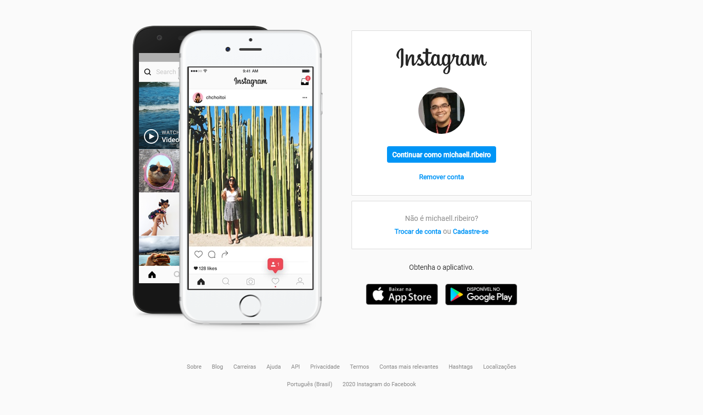

  

  #### Desafio do Bootcamp HTML Web Developer da Digital Innovation One.
  O desafio tem como proposta replicar a página de login do instagram. 
  Está sendo utilizado flexbox para o posicionamento dos elementos, 
  também está disponível para dispositivos móveis.
  
  
  
  

 

  
  

## Recursos

- **HTML 5** — Linguagem de Marcação utilizada para estruturar a página web
- **CSS** — Folha de estilo utilizada para definir a aparência.

## Iniciando

1. Clone este  reposítório usando `git clone https://github.com/michaelsribeiro/instagramClone.git
2. acesse a pasta do projeto via terminal com o comando: `cd instagramclone` 

>É necessário ter instalado o [Yarn](https://yarnpkg.com/). Consulte formas de instalar no site oficial

### Iniciando a plataforma Web

1. Em uma nova aba do terminal, acesse a pasta: `cd instagramclone`
2. Utilize o comando  `yarn` para instalar as dependẽncias 
3. Utilize o comando `yarn start` para iniciar a aplicação no seu navegador

***
